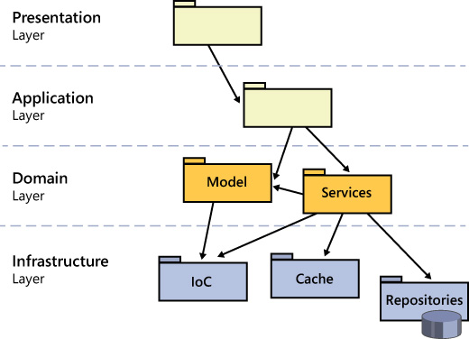
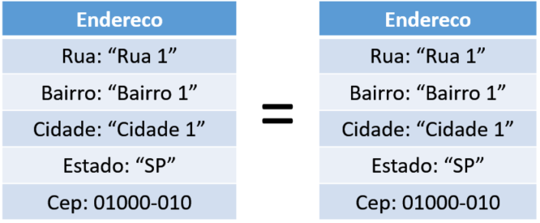

# Notifications Microservice | Clean Architecture and SOLID


> Project carried out at the  Rocketseat's `Ignite Lab | Node.js`, in this event we built a small notifications microservice using the
> best practices for developing scalable and maintainable backend applications, applying various concepts related to `Clean Architecture`,
> like `SOLID principles`, `Design Patterns` and `Domain-Driven Design` for example. We also create `unit and automated tests` to test different
> `use cases` of the application. And at the end of the event, we integrated our application with `Apache Kafka` (an open-source platform for broadcasting
> of data in a continuous stream. That is, it is a high-performance, real-time messaging system).

:arrow_right: Microservices <br /> 
:arrow_right: Domain-Driven Design (DDD) <br /> 
:arrow_right: Project Structure & Code Design <br />
:arrow_right: Nest.js | A progressive Node.js framework <br />
:arrow_right: Messaging systems <br />

<br />

## Microservices 

In software engineering, a `microservices architecture` consists of a `set of independent services limited in scope to a single business function`, called microservices. There is no single definition for the term, but component independence and limited liability are common features of this architecture, in contrast to a `monolithic` application. Another common characteristic is the communication between processes through lightweight protocols, usually HTTP.

Microservices are an `architectural and organizational approach` to software development in which the software consists of `small independent services that communicate using well-defined APIs`. These services belong to small, self-sufficient teams.

Microservices architectures facilitate scalability and streamline application development, enabling innovation and accelerating time to market for new features.

### Differences between monolithic and microservice architectures

With monolithic architectures, `all processes are highly coupled and run as a single service`. This means that if an application process experiences a spike in demand, the entire architecture must scale. The complexity of adding or enhancing features of monolithic applications increases as the code base grows. This complexity limits experimentation and makes it difficult to implement new ideas. Monolithic architectures increase application availability risk because many dependent and highly coupled processes increase the impact of a single process failure.

With a microservices architecture, an application is built as `independent components that run each application process as a service`. These services communicate through a <strong>well-defined interface using lightweight APIs</strong>. Services are created for enterprise resources and `each service performs a single function`. Because they run independently, each service can be updated, deployed, and scaled to meet the demands of specific application functions.

> Microservices must be separated by `domains` (areas of understanding/context that define a certain scope of the business rule), within these domains we can have similar `entities` but with different properties. And each microservice has its `own structure`, be it storage or application. 
 
*<i>aws.amazon.com/microservices/?nc1=h_ls</i> <br />

<br />

## Domain-Driven Design (DDD)

Domain-Driven Design, also known by the acronym DDD, provides a framework for decision-making by combining software design and development practices.

`Centered on business logic, or domain`, its basic idea proposes, through a collection of standards and design principles, to help the entire development cycle, to build applications that reflect the real understanding of business processes and rules.

DDD is beyond the way of thinking, designing and developing software, even though it is not an architectural pattern, it affects how decisions to build software are made.

### Understanding the Domain Driven Design

To define Domain-Driven Design, we first need to consolidate our understanding of `Domain`. The term is extremely relevant, since `our design is now guided by this keyword`, which `simply represents the reason the software exists`.

 > The need for software to be built is related to a delimited context of ideas, knowledge, processes and problems that one wants to solve, in which a company is inserted.

Bringing it to the real world, the `domain` of our project will be formed by all the knowledge absorbed about the company, as well as the model it operates.

This means observing the involvement of `business rules, processes and possible integrations with existing systems as part of the solution`, whether internal, from partners or suppliers.

Therefore, the Domain represents the heart of the business we are working on, with all its rules and peculiarities that DDD aims to attack, as is explicit in the title of Evans' book: “Attacking the complexities at the heart of software”.

### Strategic Design vs Tactical Design

DDD introduces us to two types of design tools.

The first one helps us solve problems related to `software modeling`, the strategic design.

While tactical design, which takes place after the strategic phase, focuses on product development, focused on the `implementation details`.

`Strategic design` brings together a set of principles and standards, to `divide a complex business problem into several blocks with clear boundaries and specific responsibilities`, thus building a topology of top-level software design.

The `tactical design`, in turn, has `a set of abstraction patterns of medium and low level components of the software`. With its practical standards, the tactician refines the result of the applied strategic design, converting it into code.

Domain-Driven Design is an evolving process consisting of iterative cycles of applying strategic and tactical design. You start with strategic design, followed by tactical design.

Developers play with tactical design tools, but if we have knowledge and a good understanding of strategic design tools, it will help us to architect better software.


### Ubiquitous Language

> Developers, with their technical bias, think about how to transform the business need into objects, relationships between them, apply abstraction, inheritance, polymorphism, patterns, frameworks, among others.

Domains Experts, in turn, know the business in depth, but are unaware of these terminologies.

Taking into account that `the software does not deal well with ambiguities`, the `Ubiquitous Language comes into play building a common language`, shared by the entire team, regardless of their role in the project. In order to reduce the conundrum exposed by James Shore in the text below.

“It's an enigma. People who are domain experts – the domain experts – are rarely qualified to write software. The people who are qualified to write software – the programmers – don't always understand the problem domain.”

`By applying it, we translate technical terms into expressions understandable to everyone involved, the same goes for the terminologies used by the business, generating an intersection between the parties.`

This joint work generates a short feedback loop, strengthening ties between business specialists and the development team, thus producing software that makes more sense for the business.


### Tactical Design

Tactical Design groups together a set of tools to be used in the construction of your `domain model`, applied in a `single delimited context`, refining the result of the work carried out through the tools of Strategic Design.

When Tactical Design patterns are used correctly, you can enrich your domain model (Domain Models), which will consequently reflect the business more clearly in the developed software. As shown below, Tactical Design can be divided into two groups.

<div align="center">

</div>

- <strong>Domain Models</strong>

Domain Models maintain the structured knowledge of the problem to be solved with the software, `representing the vocabulary and key concepts of the domain`, identifying the relationships between all entities, acting as a communication tool, together with the ubiquitous language.

`It should clearly represent the problem being solved`, as well as the proposed solution. It can also be expressed through a diagram, or even written documentation, as long as it is accessible and understandable by everyone involved in the project.

 - <strong>Domain Service</strong>

Domain Services `represents a stateless structure that provides real-world business behaviors`, as it is a domain extension, it works with flows of various entities and aggregations. As it is only relevant to `business logic`, it should not touch on technical details.

Simply put, we can understand that it absorbs Domain responsibilities that the Model could not perform.

As the domain model generally deals with more refined behaviors that focus on some specific aspects of the business, a domain service tends to follow the same principles, providing solutions for business contexts that are too complex to be stored in a single Entity or Object. of value.

The Domain Service bears no resemblance to Services at other tiers, except for the name.

*<i>zup.com.br/blog/domain-driven-design-ddd</i> <br />

<br />

## Project Structure & Code Design

### Entities and Value Objects (VOs)

 - <strong>Entities</strong>
 
```ts
// src/application/entities/notification.ts

import { Replace } from 'src/helpers/Replace';
import { Content } from './content';
import { randomUUID } from 'node:crypto';

export interface NotificationProps {
  recipientId: string;
  content: Content;
  category: string;
  readAt?: Date | null;
  canceledAt?: Date | null;
  createdAt: Date;
}

export class Notification {
  private _id: string;
  private props: NotificationProps;

  constructor(props: Replace<NotificationProps, { createdAt?: Date }>, id?: string) {
    this._id = id ?? randomUUID();
    this.props = {
      ...props,
      createdAt: props.createdAt ?? new Date(),
    };
  }

  public get id() {
    return this._id;
  }

  public set recipientId(recipientId: string) {
    this.props.recipientId = recipientId;
  }
  public get recipientId(): string {
    return this.props.recipientId;
  }

  public set content(content: Content) {
    this.props.content = content;
  }
  public get content(): Content {
    return this.props.content;
  }

  public set category(category: string) {
    this.props.category = category;
  }
  public get category(): string {
    return this.props.category;
  }

  public read() {
    this.props.readAt = new Date();
  }

  public unread() {
    this.props.readAt = null;
  }
  public get readAt(): Date | null | undefined {
    return this.props.readAt;
  }

  public get canceledAt(): Date | null | undefined {
    return this.props.canceledAt;
  }
  public cancel() {
    this.props.canceledAt = new Date();
  }

  public get createdAt(): Date {
    return this.props.createdAt;
  }
}
```
*<i>Example of an entity</i> <br />
 
An entity appears in the conversation with the domain expert as `nouns` to be associated with a certain scope of the problem, such as: "issue an invoice, register an employee or register a customer", invoice, employee and customer are entities in a given domain.

Entities are mutable, always by reference, and tend to be composed of several other objects, whether VOs or other entities, and `something important is that for them to have identity they need an identifier` because the object itself has no identity. They exist only because there are other objects to compose them, and `a change in some part of its state does not make it another object`, it remains the same if the identifier is the same. For all intents and purposes these are the classes people know about in object orientation.
 
Entities serve as a starting point so that we can think about the representation of data in the persistence model, it is common for entities to be translated into a table or collection of a relational or non-relational database.

 - <strong>Value Objects (VOs)</strong>

```ts
// src/application/entities/content.ts

export class Content {
  private readonly content: string;

  get value(): string {
    return this.content;
  }

  private validateContentLength(content: string): boolean {
    return content.length >= 5 && content.length <= 240;
  }

  constructor(content: string) {
    const isContentLengthValid = this.validateContentLength(content)
    if (!isContentLengthValid) {
      throw new Error('Content length error.')
    }
    this.content = content;
  }
}
```
*<i>Example of a value object</i> <br />

`Value Objects have their own identity and any change in their value has another object`, without changing the identity, at the same time that if two distinct objects have exactly the same state they can be considered equal.

Value Objects are usually immutable and small. They represent something unique, such as very simple quantifications or descriptions.

> The type of comparison by Identifier belongs exclusively to Entities. While the structural comparison type belongs to Value Objects. The existence of Value Objects essentially depends on the existence of one or more entities:

<div align="center">

</div>

### Use Cases Specifications 

A use case specification `captures the requirements of a system in the form of use cases described in logical and sequential steps`, so that they can meet the real needs of the user, and so that developers and testers can use these specifications described in the document use cases to be able to develop and test the specified functionalities.

> It is recommended to `separate the business logic` (which may vary over time) `from the entity class` to a specific class for the business rule.

## Repository Pattern

The Repository Pattern allows for `encapsulation of data access logic`, leveraging the use of `dependency injection (DI)` and providing a more object-oriented view of interactions with the Data Access Layer (DAL). Its use contributes to the isolation of the DAL with the business layer, better known as the domain layer.

Using this pattern, we apply the principle of `ignorant persistence (PI)` to our domain layer, that is, `our business layer entities should not be impacted by the way they are persisted in the database`.

```ts
// src/application/repositories/notifications-repository.ts

import { Notification } from '../entities/notification';

export abstract class NotificationsRepository {
  abstract create(notification: Notification): Promise<void>;
  abstract findById(notificationId: string): Promise<Notification | null>;
  abstract save(notification: Notification): Promise<void>;
  abstract countManyByRecipientId(recipientId: string): Promise<number>;
  abstract findManyByRecipientId(recipientId: string): Promise<Notification[]>;
}
```
*<i>Notification entity repository</i> <br />

A repository `is an interface/collection of abstract methods that allow access to an entity's data`, the idea is that this interface abstracts that it is dealing with the persistent environment, since `the implementation of this interface will determine a contract, which should make the implementation logic of these abstract methods`, so we have the freedom to be able to have totally distinct implementations that are independent of which method is performed, the database, frameworks or libraries. A repository is unaware of all this, `the concrete implementation only needs to fulfill the interface or the contract using the same signature as the abstract method of that repository`.

They create their dependencies or they are injected somehow. But their interfaces do not know. `A repository can be defined as an interface, which any concrete class will implement`. This class can even add more methods, but nobody will know they exist, because the class will always be behind an abstraction, which is the interface.

> In software engineering, dependency injection is a design pattern in which an object or function is given other objects or functions that it depends on.

See the implementations:

```ts
// src/application/use-cases/get-recipient-notifications.ts

@Injectable()
export class GetRecipientNotifications {
  constructor(private notificationsRepository: NotificationsRepository) {}

  async execute(
    request: GetRecipientNotificationsRequest,
  ): Promise<GetRecipientNotificationsResponse> {
    const { recipientId } = request;

    const notifications =
      await this.notificationsRepository.findManyByRecipientId(recipientId);

    return {
      notifications,
    };
  }
}
```
*<i>a use case that calls a method from the repository</i> <br />

```ts
// src/infra/http/controllers/notifications.controller.ts

@Controller('notifications')
export class NotificationsController {
  constructor(
    // ...
    private countRecipientNotifications: CountRecipientNotifications,
    private getRecipientNotifications: GetRecipientNotifications,
  ) {}

  @Get('from/:recipientId')
  async getFromRecipient(@Param('recipientId') recipientId: string) {

    const { notifications } = await this.getRecipientNotifications.execute({
      recipientId,
    });

    return {
      notifications: notifications.map(NotificationViewModel.toHTTP),
    };
  }
}
```
*<i>http layer calling a use case method</i> <br />

```ts
// src/infra/database/prisma/repositories/prisma-notifications-repository.ts

@Injectable()
export class PrismaNotificationsRepository implements NotificationsRepository {
  constructor(private prisma: PrismaService) {}

  async findManyByRecipientId(recipientId: string): Promise<Notification[]> {

    const notifications = await this.prisma.notification.findMany({
      where: {
        recipientId,
      },
    });

    return notifications.map(PrismaNotificationMapper.toDomain);
  }
}
```
*<i>implementation in the persistence layer of the repository's findManyByRecipientId method</i> <br />

```ts
// test/repositories/in-memory-notifications-repository.ts

export class InMemoryNotificationsRepository
  implements NotificationsRepository
{
  public notifications: Notification[] = [];


  async findManyByRecipientId(recipientId: string): Promise<Notification[]> {
  
    return this.notifications.filter(
      (notification) => notification.recipientId === recipientId,
    );
  }
}
```
*<i>implementation in the memory layer (for testing purposes) of the repository's findManyByRecipientId method</i> <br />

### Factory Pattern

Creating an object often requires complex processes not appropriate to include within the object's composition. Creating the object might require significant code duplication, might need information not accessible to the object's composition, might not provide a sufficient degree of abstraction, or might not be part of the object's composition concerns. `The factory method design pattern handles these problems by defining a separate method for creating objects`, which subclasses can override to specify the "derived type" of the product to be created.

A factory is `responsible for creating objects or instantiating classes following some commonly reusable model in the application`. One of the reasons for creating factories is code isolation/encapsulation/decoupling and always following a certain model when creating an object that can be overwritten.

Simple application of a Factory:

```ts
// test/factories/notifications-factory.ts

import { Content } from '@application/entities/content';
import {
  Notification,
  NotificationProps,
} from '@application/entities/notification';

type Override = Partial<NotificationProps>;

export function makeNotification(override: Override = {}) {
  return new Notification({
    content: new Content('Nova solicitação de amizade!'),
    category: 'social',
    recipientId: 'recipient-id',
    ...override,
  });
}
```

```ts
// src/application/use-cases/get-recipient-notification.spec.ts

describe('Get recipient notifications', () => {
  it('should be able to get recipient notifications', async () => {
    const notificationsRepository = new InMemoryNotificationsRepository();
    const getRecipientNotifications = new GetRecipientNotifications(
      notificationsRepository
    );

    await notificationsRepository.create(
      makeNotification({ recipientId: 'recipient-id' }),
    );
    await notificationsRepository.create(
      makeNotification({ recipientId: 'recipient-id' }),
    );
    await notificationsRepository.create(
      makeNotification({ recipientId: 'another-recipient-id' }),
    );

    const { notifications } = await getRecipientNotifications.execute({
      recipientId: 'recipient-id',
    });

    // ...
  });
});
```

> input -> validation -> compute -> return/output


